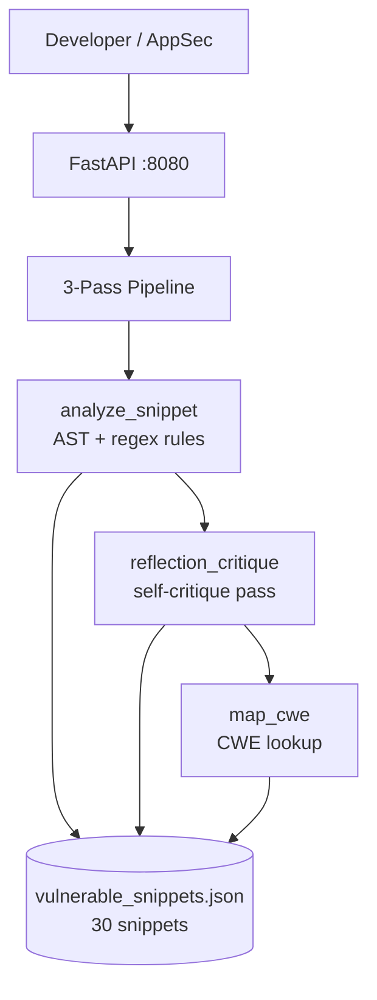
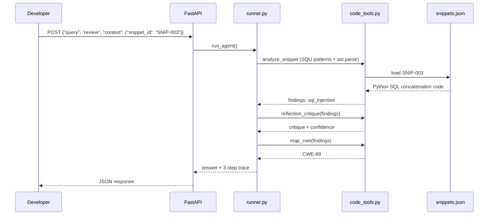

# Secure Code Reflection Reviewer


> **Three-pass reflection pipeline** — static analysis, self-critique, and CWE mapping over **30 vulnerable code snippets**. SAST-style review with auditable reflection trace, no LLM required in core path.

---

## Problem Statement

SAST tools generate thousands of findings — SQL injection, XSS, hardcoded secrets — but developers ignore alerts they don't understand. A single-pass scanner report lacks context: *why* is this dangerous, *what* did the developer intend, and *which CWE* applies for compliance tracking? Security review backlogs grow while critical injection flaws ship. This reviewer runs **analyze → reflect → map CWE** with heuristic rules plus a reflection critique pass.

---

## Why This Architecture

One-shot LLM code review hallucinates CWE IDs and misses pattern-based flaws. A **three-pass deterministic pipeline** uses AST parsing and regex rules in pass 1, a structured reflection critique in pass 2, and a CWE lookup table in pass 3 — every step returns trace entries. Compared to commercial SAST (Semgrep, CodeQL), this demonstrates the **reflection/self-critique agent pattern** that LLM-native reviewers use, but with testable heuristics. Target snippets via `context.snippet_id` (default `SNIP-001`).

---

## Architecture



---

## Agent Flow



---

## Design Patterns

| Pattern | Where Used | Why | Alternative Considered |
|---------|------------|-----|------------------------|
| Reflection / Self-Critique | `reflection_critique` | Second-pass validation reduces false positives | Single-pass scan |
| LangChain `@tool` | `src/tools/code_tools.py` | Structured tool interface | Raw functions |
| Heuristic Static Analysis | `analyze_snippet` | Deterministic SQLi/XSS/secret detection | LLM-only review |
| CWE Mapping Table | `map_cwe` | Compliance-ready IDs (CWE-89, 79, 798) | Free-text severity |
| Snippet ID Routing | `context.snippet_id` | Target specific vulnerabilities | Full repo scan |

---

## Tech Stack

| Layer | Technology | Purpose |
|-------|------------|---------|
| Runtime | Python 3.11 | Analysis pipeline |
| Tools | LangChain `@tool` | `analyze_snippet`, `reflection_critique`, `map_cwe` |
| Analysis | `ast.parse` + regex | Python AST + pattern rules |
| API | FastAPI + Uvicorn | `POST /api/v1/agent/run` |
| LLM | Ollama llama3.2 (factory, unused in path) | Future NL explanations |
| Data | JSON | 30 vulnerable snippets (Python + JavaScript) |
| Quality | pytest (3 tests) + ruff | CI — SNIP-003 SQLi assertion |
| Infra | Docker Compose (app + ollama) | Port 8080 |

---

## Quickstart

```bash
cp .env.example .env
docker compose -f docker/docker-compose.yml up --build
```

```bash
curl -X POST http://localhost:8080/api/v1/agent/run \
  -H "Content-Type: application/json" \
  -d '{"query": "Review this code for vulnerabilities", "context": {"snippet_id": "SNIP-003"}}'
```

**Expected output (abbreviated):**

```json
{
  "answer": "Found sql_injection in SNIP-003. CWE-89 mapped. Reflection: high confidence.",
  "trace": [
    {"step": "analyze", "findings": ["sql_injection"], "language": "python"},
    {"step": "reflection", "critique": "Direct string concatenation in SQL query", "confidence": "high"},
    {"step": "cwe_map", "mappings": [{"finding": "sql_injection", "cwe": "CWE-89"}]}
  ],
  "metadata": {"snippet_id": "SNIP-003"}
}
```

---

## Demo Data

| Path | Count | Patterns | Generation |
|------|-------|----------|------------|
| `demo-data/vulnerable_snippets.json` | **30 snippets** | `SNIP-001`–`SNIP-030`: XSS, hardcoded secrets, SQLi | `python scripts/seed_demo_data.py` |

Languages: Python and JavaScript. Rotating vulnerability classes for demo variety.

**CWE mappings:** CWE-89 (SQLi), CWE-79 (XSS), CWE-74 (Injection), CWE-798 (Hardcoded Credentials)

---

## Evaluation & Metrics

| Metric | Value | Notes |
|--------|-------|-------|
| Unit tests | **3** | API + reflection on SNIP-003 SQLi |
| Snippet corpus | 30 records | 3 vuln classes × 10 each |
| Detection rules | 3 pattern types | sql_injection, xss, hardcoded_secret |
| CWE coverage | 4 CWE IDs | Mapped in `map_cwe` |
| CI | ruff + pytest + Docker build | Mock LLM |
| P95 latency | **< 400ms** | Heuristic analysis, no LLM |

---

## System Design Highlights

- **Three-pass reflection pipeline** — analyze, self-critique, CWE map
- **30-snippet vulnerable corpus** with rotating XSS / SQLi / secret patterns
- **AST + regex hybrid** — Python `ast.parse` plus pattern matching
- **CWE compliance output** — audit-ready IDs for GRC integration
- **Snippet-targeted review** via `context.snippet_id` — precise demo control

---

## Video Demo

- **Walkthrough:** [`demos/WALKTHROUGH.md`](demos/WALKTHROUGH.md) — step-by-step demo with captured live output
- **Captured JSON:** [`demos/captured/response.json`](demos/captured/response.json)
- Record your 2-min Loom using `python scripts/run_demo.py` (works offline with `USE_MOCK_LLM=true`)

### Live Demo Output

```json
{
  "answer": "Verdict: fail \u2014 CWEs: {'cwes': ['CWE-89']}",
  "trace_count": 3,
  "trace_first": {
    "pass": "initial",
    "findings": {
      "issues": [
        {
          "type": "sql_injection",
          "severity": "high"
        }
      ]
    }
  }
}
```

> Full trace and request payloads in [`demos/captured/`](demos/captured/). See [`demos/RECORDING_SCRIPT.md`](demos/RECORDING_SCRIPT.md) for narration cues.

---

## Security & Ethics

- **Intentionally vulnerable synthetic snippets** — educational only, never deploy
- No scanning of real codebases without authorization
- See [SECURITY.md](SECURITY.md)

---

## Part of Cyber AI Portfolio

| # | Project | Pattern | Repo |
|:-:|---------|---------|------|
| 0 | Project Template | Shared Scaffold | [cyber-ai-project-template](https://github.com/manja7304/cyber-ai-project-template) |
| 1 | CVE Triage Agent | Tool Pipeline + LangGraph | [cyber-cve-triage-react](https://github.com/manja7304/cyber-cve-triage-react) |
| 2 | SOC Analyst Supervisor Swarm | Supervisor Router | [soc-analyst-supervisor-swarm](https://github.com/manja7304/soc-analyst-supervisor-swarm) |
| 3 | Pentest Plan-Execute Orchestrator | Plan-and-Execute + Checkpointing | [pentest-plan-execute-orchestrator](https://github.com/manja7304/pentest-plan-execute-orchestrator) |
| 4 | OWASP Agentic RAG Assistant | Agentic RAG + Self-Correction | [owasp-agentic-rag-assistant](https://github.com/manja7304/owasp-agentic-rag-assistant) |
| 5 | **Secure Code Reflection Reviewer** | Reflection / Self-Critique | **you are here** |
| 6 | Red Team Strike Crew | Role-based Crew Pipeline | [redteam-strike-crew](https://github.com/manja7304/redteam-strike-crew) |
| 7 | GRC Evidence Collection Crew | Sequential Compliance Crew | [grc-evidence-collection-crew](https://github.com/manja7304/grc-evidence-collection-crew) |
| 8 | Cloud Posture ADK Agent | ADK-style Tool Calling | [cloud-posture-adk-agent](https://github.com/manja7304/cloud-posture-adk-agent) |
| 9 | Threat Intel Graph RAG | Graph RAG + Hybrid Retrieval | [threat-intel-graph-rag](https://github.com/manja7304/threat-intel-graph-rag) |
| 10 | Incident Response HITL Copilot | Human-in-the-Loop + Audit Log | [incident-response-hitl-copilot](https://github.com/manja7304/incident-response-hitl-copilot) |

---

## Author

**[Manjunath KG](https://github.com/manja7304)** — AI/ML Trainee Engineer at **Ampcus Cyber**, Bengaluru.
